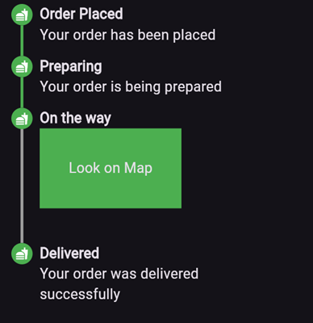

<div align="center">


</div>

A simple package to build steppers with custom elements. You can set up your own body content, badges, and paths using indexed builders.

# Vertical Stepper
To create a vertical stepper, set `stepperDirection` to `Axis.vertical`.

```dart
UniversalStepper(
  inverted: false,
  stepperDirection: Axis.vertical,
  elementBuilder: (context, index) {
    return Expanded(
      child: Container(
        padding: const EdgeInsets.only(left: 10, bottom: 15),
        child: ... // your element
      ),
    );
  },
  badgeBuilder: (context, index) {
    return Container(
      width: 30,
      padding: const EdgeInsets.all(6),
      decoration: const BoxDecoration(
        color: Colors.green,
        borderRadius: BorderRadius.all(Radius.circular(30)),
      ),
      child: const FittedBox(child: Icon(Icons.fastfood, color: Colors.white)),
    );
  },
  pathBuilder: (context, index) {
    return Container(
      color: index == stepperData.length - 1
          ? Colors.transparent
          : (index < currentStep ? Colors.green : Colors.grey),
      width: 4,
    );
  },
  subPathBuilder: (context, index) {
    return Container(
      color: index == stepperData.length - 1
          ? Colors.transparent
          : (index < currentStep ? Colors.green : Colors.grey),
      width: 4,
    );
  },
  elementCount: stepperData.length,
  badgePosition: StepperBadgePosition.start,
)
```
Here’s an example of what the result might look like:



## Parameters

- `elementBuilder`: A builder for the content of the stepper.

- `badgeBuilder`: A builder for the badge.

- `badgePosition`: Determines the alignment of the badge. Options include `StepperBadgePosition.start`, `StepperBadgePosition.center`, or `StepperBadgePosition.end`.

- `pathBuilder`: A builder for the main path (e.g., a line, dotted line, etc.). This is the most commonly used path.

- `subPathBuilder`: A builder for the secondary path, used when `badgePosition` is set to `StepperBadgePosition.center`. This path is displayed under the badge and allows you to control its visibility based on the active step.

- `elementCount`: The number of elements in the stepper.

- `inverted`: A flag to invert the position of the path and badge relative to the element. By default, this is false, and for vertical steppers, the path appears on the left. When set to true, the path appears on the right. For horizontal steppers, the path appears on the top and when set to true, the path appears on the bottom.

For example, if you set `inverted` to true and `badgePosition` to `StepperBadgePosition.center`, the result will look like this:


# Horizontal Stepper
To create a horizontal stepper, set stepperDirection to Axis.horizontal.

Here’s an example of a horizontal stepper:


And here’s the inverted variant:


For full examples, check out the [example app](https://github.com/ArturLevchuk/universal_stepper/tree/master/example).